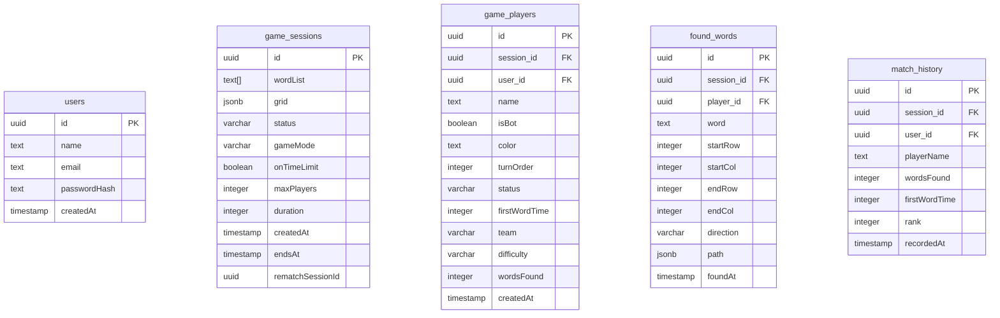

# Word Search Multiplayer Game

Многопользовательская игра "Филворд" (Word Search) с реальным временем через WebSocket и tRPC.

## 🚀 Быстрый старт

### Требования

- Node.js 18+
- PostgreSQL 14+
- npm или yarn

### Установка

```bash
# Клонировать репозиторий
git clone https://github.com/Kanedgyy/word-search.git

# Установить зависимости
npm install

# Скопировать переменные окружения
cp .env.example .env.local

# Настроить базу данных
# 1. Создайте базу данных в PostgreSQL
# 2. Укажите connection string в .env.local

# Запустить миграции
npx drizzle-kit push

# Запустить разработочный сервер
npm run dev
```

## 📁 Структура проекта

```
├── app/                    # Next.js App Router (только роутинг)
│   ├── api/               # API endpoints (tRPC, WebSocket)
│   ├── game/              # Страница игры
│   ├── stats/             # Статистика игроков
│   └── page.tsx           # Главная страница
├── components/            # UI компоненты (presentational)
├── features/              # Feature modules (бизнес-логика)
│   ├── game/
│   │   ├── ui/           # Компоненты игры
│   │   ├── api/          # tRPC роутеры
│   │   ├── hooks/        # React hooks
│   │   ├── services/     # Бизнес-логика
│   │   ├── types/        # TypeScript типы
│   │   └── utils/        # Утилиты
│   └── stats/
│       └── ui/
├── server/                # Server-side code
│   ├── bot.ts            # Логика ботов
│   └── trpc/             # tRPC setup
├── lib/                   # Общие утилиты
├── drizzle/              # Схема БД и миграции
└── tests/                # Тесты
```

## 🗄️ Схема базы данных



## 🔌 tRPC API

### game.createSession

Создаёт новую игровую сессию.

**Input:**
```typescript
{
  maxPlayers: number;      // 2-6
  duration: number;        // 60-600 секунд
  gameMode: 'individual' | 'team';
  onTimeLimit: boolean;
}
```

**Output:**
```typescript
{
  sessionId: string;
  grid: string[][];
  wordList: string[];
  maxPlayers: number;
  duration: number;
  gameMode: 'individual' | 'team';
  onTimeLimit: boolean;
}
```

### game.joinSession

Присоединяется к существующей сессии.

**Input:**
```typescript
{
  sessionId: string;
  playerName: string;
  userId?: string;        // Better Auth user ID
}
```

**Output:**
```typescript
{
  playerId: string;
  color: string;
  playersCount: number;
  isHost: boolean;
}
```

### game.startGame

Запускает игру в сессии.

**Input:**
```typescript
{ sessionId: string }
```

**Output:**
```typescript
{
  message: string;
  grid: string[][];
  playerCount: number;
}
```

### game.submitWord

Отправляет найденное слово.

**Input:**
```typescript
{
  sessionId: string;
  playerId: string;
  word: string;
  startRow: number;
  startCol: number;
  endRow: number;
  endCol: number;
  direction: 'horizontal' | 'vertical' | 'diagonal_down' | 'diagonal_up';
  path?: Array<{ row: number; col: number }>;
}
```

**Output:**
```typescript
{
  success: boolean;
  word?: string;
  error?: string;
  playerScore?: number;
  results?: Array<{
    rank: number;
    name: string;
    wordsFound: number;
    isBot: boolean;
  }>;
  gameEnded: boolean;
}
```

### game.getSessionState

Получает текущее состояние сессии.

**Input:**
```typescript
{
  sessionId: string;
  playerId?: string;
}
```

**Output:**
```typescript
{
  id: string;
  status: 'waiting' | 'in_progress' | 'finished';
  grid: string[][];
  wordList: string[];
  players: Player[];
  foundWords: string[];
  foundCellsMap: Record<string, string>;
  teams?: Team[];
  // ... другие поля
}
```

## 🔌 WebSocket Events

WebSocket используется для real-time обновлений.

### Клиент → Сервер

| Event | Payload | Описание |
|-------|---------|----------|
| `join_game` | `{ sessionId, playerId }` | Присоединение к игре |
| `word_selected` | `{ word, path, direction }` | Выбор слова |
| `player_left` | `{ playerId }` | Уход игрока |

### Сервер → Клиент

| Event | Payload | Описание |
|-------|---------|----------|
| `game_update` | `{ players, foundWords, ... }` | Обновление состояния |
| `word_found` | `{ word, playerId, score }` | Найдено слово |
| `game_finished` | `{ results, ... }` | Игра завершена |

## 🎮 Сложность ботов

| Сложность | Min Delay | Max Delay | Accuracy | Skip Chance |
|-----------|-----------|-----------|----------|-------------|
| Лёгкий | 3200ms | 8000ms | 35% | 25% |
| Средний | 2000ms | 6000ms | 45% | 20% |
| Сложный | 1200ms | 4000ms | 60% | 10% |

## 🧪 Тестирование

```bash
# Unit тесты
npm run test

# Интеграционные тесты
npm run test:integration

# E2E тесты (Playwright)
npm run test:e2e

# Покрытие кода
npm run test:coverage
```

## 📝 Scripts

| Command | Описание |
|---------|----------|
| `npm run dev` | Запуск dev сервера |
| `npm run build` | Сборка для продакшена |
| `npm run start` | Запуск production сервера |
| `npm run lint` | Проверка кода ESLint |
| `npm run format` | Форматирование Prettier |
| `npx drizzle-kit push` | Применить миграции |
| `npx drizzle-kit generate` | Создать миграцию |

## 🛠️ Tech Stack

- **Frontend:** Next.js 14, React 18, TypeScript
- **Backend:** tRPC, Next.js API Routes
- **Database:** PostgreSQL + Drizzle ORM
- **Real-time:** WebSocket
- **Auth:** Better Auth (localStorage-based)
- **Styling:** Tailwind CSS
- **Testing:** Jest, React Testing Library

## 📄 License

MIT
